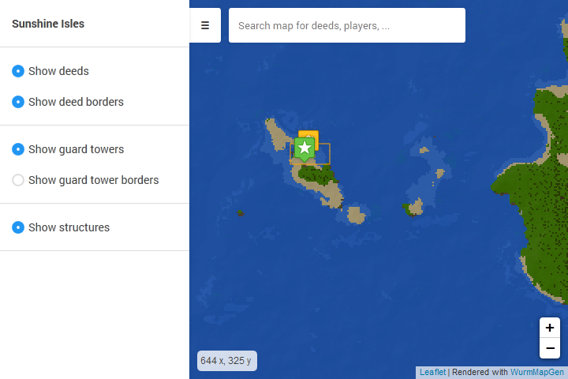

# WurmMapGen
Interactive tile map generator for Wurm Unlimited servers.

## Features
- Flexible instant search for any marker on the map
- Realtime updated player location markers (optional)
- Extensive [configuration options](https://github.com/woubuc/WurmMapGen/wiki/Configuration)

## Installation
1. Download the latest release from the [releases page](https://github.com/woubuc/WurmMapGen/releases)
2. Unpack the downloaded archive
3. Adjust the [settings](https://github.com/woubuc/WurmMapGen/wiki/Configuration)
in the properties file.
4. Run WurmMapGen.jar

### Master branch
When using this application in production, never directly use the code
from the master branch, as it may contain unfixed bugs.

Always use the downloads on the releases page in the Github repository.

## Template
The `index.html` file will be parsed as a
[mustache](https://mustache.github.io/mustache.5.html) template.

The following template variables are available:

- `{{serverName}}` string, the name of the server
- `{{enableRealtimeMarkers}}` bool, true if realtime markers are enabled
- `{{showPlayers}}` bool, true if player markers are enabled
- `{{showDeeds}}` bool, true if deed markers are enabled
- `{{showGuardTowers}}` bool, true if guard tower markers are enabled
- `{{showStructures}}` bool, true if structure markers are enabled

These values are configured in the properties file.

### Editing the template
Always make sure to edit the template in the `./template` directory
next to the jar. Any output files will be overwritten by the application
upon its next run.

## Development

### Releases
A release should contain the following three items:
- `WurmMapGen.jar`
- The properties file `WurmMapGen.properties`
- The `template` directory

When adding a release, create a tag in the repository, then generate a
release archive and upload it to the releases page.
